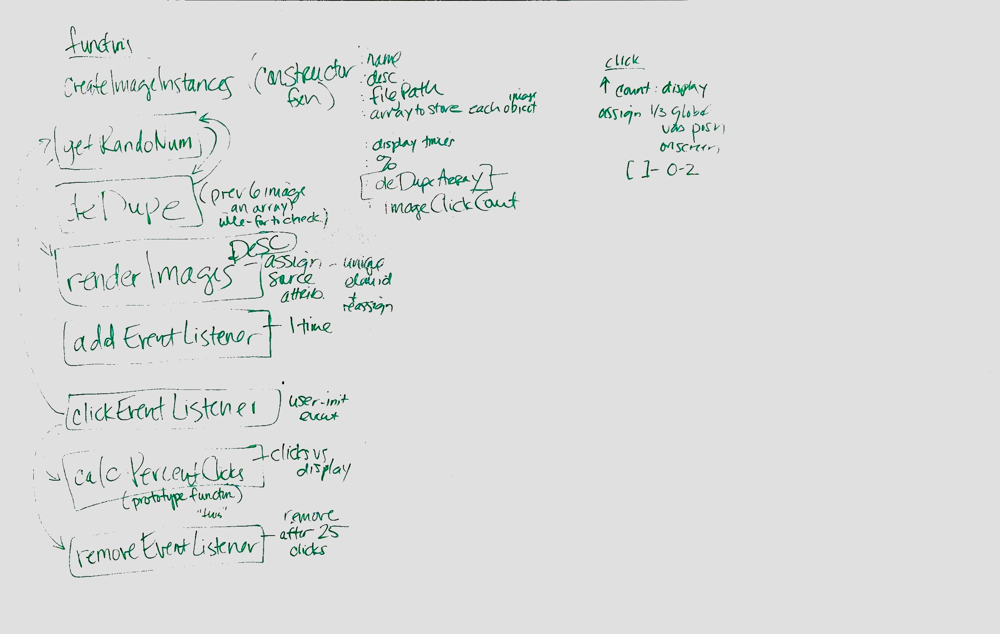

# bus-mall

- Driver: Corey Chang
- Navigator: Jonathan Kimball
- [User Stories](user_stories.md)

## Using Local Storage to Preserve State

We are recording the page state in local storage.  This includes:

- The full product list as one entry per product
  - Key: "Product-N" where N is the product ID
  - Value: JSON of Product object
- The displayedProducts array
  - Key: displayedProducts
  - Value: Array of product IDs
- The totalClickCount value
  - Key: totalClickCount
  - Value: Number of clicks

Product ID is defined as the products index into the Product.list array.

## Whiteboard

